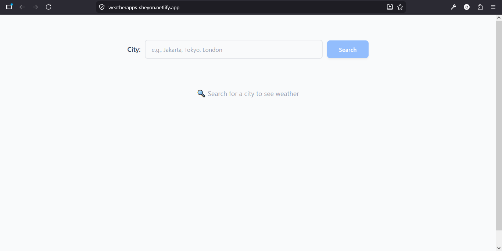

# 🌤️ Weather App

A beautiful, responsive weather application built with React that shows current weather and 5-day forecasts for cities worldwide.



## ✨ Features

- 🔍 **City Search** - Search for any city worldwide
- 🌡️ **Current Weather** - Temperature, conditions, humidity, wind speed
- 📅 **5-Day Forecast** - Daily weather predictions
- 🎨 **Dynamic Backgrounds** - Colors change based on weather conditions
- ⏳ **Loading States** - Visual feedback during API calls
- ❌ **Error Handling** - Friendly messages for invalid cities
- 📱 **Responsive Design** - Works perfectly on mobile, tablet, and desktop

## 🛠️ Technologies Used

- **React** - UI library
- **Tailwind CSS** - Styling
- **OpenWeatherMap API** - Weather data
- **Vite** - Build tool and development server

## 🚀 Live Demo

[View Live Demo](https://weatherapps-sheyon.netlify.app/)

## ScreenShoot
(./src/assets/WeatherAppSS2.png)

## 🏗️ Installation & Setup

1. **Clone the repository**
   ```bash
   git clone https://github.com/Sheyon565/weather-app.git
   cd weather-app